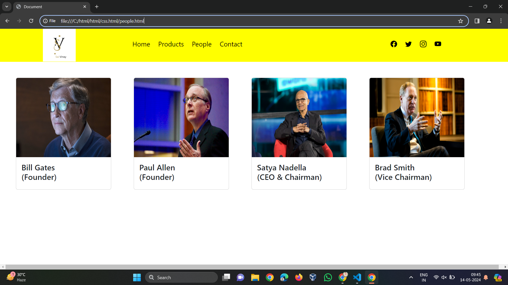
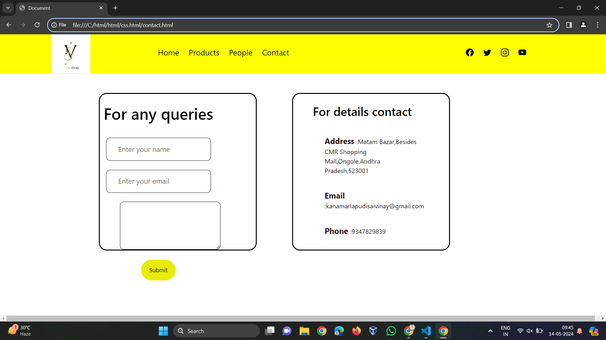

# Ex.07 Software Product Company Website
## Date:

## AIM:
To develop a static company website to display the softwares and services provided by the company.

## DESIGN STEPS:

### Step 1:
Requirement collection.

### Step 2:
Creating the layout using HTML and CSS.

### Step 3:
Updating the sample content.

### Step 4:
Choose the appropriate style and color scheme.

### Step 5:
Validate the layout in various browsers.

### Step 6:
Validate the HTML code.

### Step 7:
Publish the website in the given URL.

## PROGRAM:

software app

```
<!DOCTYPE html>
<html lang="en">
<head>
    <meta charset="UTF-8">
    <meta name="viewport" content="width=device-width, initial-scale=1.0">
    <title>Document</title>
    <link href="https://cdn.jsdelivr.net/npm/bootstrap@5.3.3/dist/css/bootstrap.min.css" rel="stylesheet" integrity="sha384-QWTKZyjpPEjISv5WaRU9OFeRpok6YctnYmDr5pNlyT2bRjXh0JMhjY6hW+ALEwIH" crossorigin="anonymous">
    <link rel="stylesheet" href="https://cdn.jsdelivr.net/npm/bootstrap-icons@1.11.3/font/bootstrap-icons.min.css">
    <style>
        a{
            color: black;
            font-size: 20px;
            padding: 10px;
            text-decoration: none;
        }
            .content {
                position: absolute;
                top: 50%;
                left: 50%;
                transform: translate(-50%,-50%);
                text-align: center;
            }
            .text h2 {
                color: red;
                font-weight: 800;
                font-size: 50px;
                letter-spacing: 3px;
            }
            .text p {
                color: red;
                text-transform: capitalize;
                font-size: 15px;
                margin-bottom: 30px;
                word-spacing: 2px;
                letter-spacing: 1px;
            }
            .login {
                margin: 0px 10px;
                border: 2px solid yellow;
                padding: 13px 35px;
                letter-spacing: 1px;
                color:black;
                border-radius: 30px;
                background-color: yellow;
                text-decoration: none;
            }
            .login:hover {
                border: 2px solid yellow;
                color: yellow;
                background-color: black;
                transition: 0.5s;
                cursor: pointer;
            } 
            .signup {
                margin: 0px 10px;
                border: 2px solid yellow;
                padding: 13px 35px;
                letter-spacing: 1px;
                color:black;
                border-radius: 30px;
                background-color:  yellow;
                text-decoration: none;
            }
            .signup:hover {
                border: 2px solid gold;
                color: gold;
                background-color: black;
                transition: 0.5s;
                cursor: pointer;
            }
    </style>
</head>
<body>
    <div class="row" style="height: 100px;background-color: yellow;">
        <div class="col-1"></div>
        <div class="col-2">
            
        </div>
        <div class="col-6" style="margin-top: 30px;">
            <a href="">Home</a>
            <a href="">Products</a>
            <a href="">People</a>
            <a href="">Contact</a>
        </div>
        <div class="col-2" style="margin-top: 30px;">
            <a href=""><i class="bi bi-facebook"></i></a>
            <a href=""><i class="bi bi-twitter"></i></a>
            <a href=""><i class="bi bi-instagram"></i></a>
            <a href=""><i class="bi bi-youtube"></i></a>
        </div>
        <div class="col-1"></div>
        
    </div>
    <div class="content">
        <div class="text">
            <h2>InnovateSoft Solutions </h2>
            <br>
            <p> Transforming Ideas into Impartful Reality through Precision Coding and Innovation </p>
            <br>
            <div>
                <a href="#" class="login"> Log In </a>
                <a href="#" class="signup"> Sign Up </a>
            </div>
        </div>
    </div>  
    </div>
</body>
</html>

    
```
product

```
<!DOCTYPE html>
<html lang="en">
<head>
    <meta charset="UTF-8">
    <meta name="viewport" content="width=device-width, initial-scale=1.0">
    <title>Document</title>
    <link href="https://cdn.jsdelivr.net/npm/bootstrap@5.3.3/dist/css/bootstrap.min.css" rel="stylesheet" integrity="sha384-QWTKZyjpPEjISv5WaRU9OFeRpok6YctnYmDr5pNlyT2bRjXh0JMhjY6hW+ALEwIH" crossorigin="anonymous">
    <link rel="stylesheet" href="https://cdn.jsdelivr.net/npm/bootstrap-icons@1.11.3/font/bootstrap-icons.min.css">
    <style>
        a{
            color: black;
            font-size: 20px;
            padding: 10px;
            text-decoration: none;
        }
        footer {
                background-color: gold;
                margin-top: auto;
            }
    </style>
</head>
<body>
    <div class="row" style="height: 100px;background-color:yellow;">
        <div class="col-1"></div>
        <div class="col-2">
            
        </div>
        <div class="col-6" style="margin-top: 30px;">
            <a href="">Home</a>
            <a href="">Products</a>
            <a href="">People</a>
            <a href="">Contact</a>
        </div>
        <div class="col-2" style="margin-top: 30px;">
            <a href=""><i class="bi bi-facebook"></i></a>
            <a href=""><i class="bi bi-twitter"></i></a>
            <a href=""><i class="bi bi-instagram"></i></a>
            <a href=""><i class="bi bi-youtube"></i></a>
        </div>
        <div class="col-1"></div>
    </div>

    <div class="row my-5">
        <div class="col-2 mx-5">
            <div class="card" style="width: 18rem;">
                
                <div class="card-body">
                    <h4>Artificial Intelligence</h4>
                </div>
            </div>
        </div>


    <div class="col-2 mx-5">
        <div class="card" style="width: 18rem;">
            
            <div class="card-body">
                <h4>Cloud Solutions</h4>
            </div>
        </div>
    </div>

    <div class="col-2 mx-5">
        <div class="card" style="width: 18rem;">
            
            <div class="card-body">
                <h4>Mobile Applications</h4>
            </div>
        </div>
    </div>

    <div class="col-2 mx-5">
        <div class="card" style="width: 18rem;">
            
            <div class="card-body">
                <h4>Machine Learning</h4>
            </div>
        </div>
    </div>
</div>
<footer>
    <center> Designed and Developed by Priyadharshini P (212223240128) </center>
</footer>
</body>
</html>

```
people

```
<!DOCTYPE html>
<html lang="en">
<head>
    <meta charset="UTF-8">
    <meta name="viewport" content="width=device-width, initial-scale=1.0">
    <title>Document</title>
    <link href="https://cdn.jsdelivr.net/npm/bootstrap@5.3.3/dist/css/bootstrap.min.css" rel="stylesheet" integrity="sha384-QWTKZyjpPEjISv5WaRU9OFeRpok6YctnYmDr5pNlyT2bRjXh0JMhjY6hW+ALEwIH" crossorigin="anonymous">
    <link rel="stylesheet" href="https://cdn.jsdelivr.net/npm/bootstrap-icons@1.11.3/font/bootstrap-icons.min.css">
    <style>
        a{
            color: black;
            font-size: 20px;
            padding: 10px;
            text-decoration: none;
        }
    </style>
</head>
<body>
    <div class="row" style="height: 100px;background-color:yellow;">
        <div class="col-1"></div>
        <div class="col-2">
            
        </div>
        <div class="col-6" style="margin-top: 30px;">
            <a href="">Home</a>
            <a href="">Products</a>
            <a href="">People</a>
            <a href="">Contact</a>
        </div>
        <div class="col-2" style="margin-top: 30px;">
            <a href=""><i class="bi bi-facebook"></i></a>
            <a href=""><i class="bi bi-twitter"></i></a>
            <a href=""><i class="bi bi-instagram"></i></a>
            <a href=""><i class="bi bi-youtube"></i></a>
        </div>
        <div class="col-1"></div>
    </div>

    <div class="row my-5">
        <div class="col-2 mx-5">
            <div class="card" style="width: 18rem;">
                
                <div class="card-body">
                    <h4>Bill Gates  <br> (Founder) </h4>
                </div>
            </div>
        </div>


    <div class="col-2 mx-5">
        <div class="card" style="width: 18rem;">
            
            <div class="card-body">
                <h4>Paul Allen <br> (Founder) </h4>
            </div>
        </div>
    </div>

    <div class="col-2 mx-5">
        <div class="card" style="width: 18rem;">
            
            <div class="card-body">
                <h4>Satya Nadella <br> (CEO & Chairman)</h4>
            </div>
        </div>
    </div>

    <div class="col-2 mx-5">
        <div class="card" style="width: 18rem;">
            
            <div class="card-body">
                <h4>Brad Smith <br> (Vice Chairman)</h4>
            </div>
        </div>
    </div>
</div>
</body>
</html>

```
contanct

```
<!DOCTYPE html>
<html lang="en">
<head>
    <meta charset="UTF-8">
    <meta name="viewport" content="width=device-width, initial-scale=1.0">
    <title>Document</title>
    <link href="https://cdn.jsdelivr.net/npm/bootstrap@5.3.3/dist/css/bootstrap.min.css" rel="stylesheet" integrity="sha384-QWTKZyjpPEjISv5WaRU9OFeRpok6YctnYmDr5pNlyT2bRjXh0JMhjY6hW+ALEwIH" crossorigin="anonymous">
    <link rel="stylesheet" href="https://cdn.jsdelivr.net/npm/bootstrap-icons@1.11.3/font/bootstrap-icons.min.css">
    <style>
        a{
            color: black;
            font-size: 20px;
            padding: 10px;
            text-decoration: none;
        }
        .box {
                display: flex;
                column-gap: 40px;
                background: transparent;
                position: relative;
                top: 50px;
            }
            .box-1 {
                height: 400px;
                width: 400px;
                border: 3px solid black;
                border-radius: 20px;
                background: transparent;
                position: relative;
                left: 250px;
            }
            .box-2 {
                height: 400px;
                width: 400px;
                border: 3px solid black;
                border-radius: 20px;
                background: transparent;
                position: relative;
                left: 300px;
            }
            .box-1 form {
                display: flex;
                color: black;
                background: transparent;
                padding: 10px;
                font-size: 15px;
                position: relative;
                top: 15px;
            }
            .box-1 form input {
                background: transparent;
                display: flex;
                border: 1px solid rgb(30, 4, 4);
                border-radius: 10px;
                padding: 15px 30px;
                font-size: 18px;
                color: black;
                position: relative;
                top: 30px;
            }
            .box-1 form textarea {
                background: transparent;
                color: rgb(32, 7, 7);
                padding: 15px 10px;
                position: relative;
                top: 30px;
                left: 30px;
                border: 1px solid black;
                border-radius: 10px;
            }
            .box-1 form button {
                border: 0;
                outline: none;
                padding: 15px 20px;
                color: black;
                border-radius: 30px;
                background: rgb(232, 236, 10);
                cursor: pointer;
                position: relative;
                top: 50px;
            }
            .box-2 h2 {
                color: rgb(0, 0, 0);
                position: relative;
                top: 25px;
                left: 50px;
                font-size: 30px;
            }
            .box-2 p {
                color: black;
                position: relative;
                top: 50px;
                padding: 10px 80px;
            }
            .box-2 span {
                color: rgb(35, 6, 6);
                font-size: 20px;
            }
            
    </style>
</head>
<body>
    <div class="row" style="height: 100px;background-color: yellow;">
        <div class="col-1"></div>
        <div class="col-2">
            
        </div>
        <div class="col-6" style="margin-top: 30px;">
            <a href="">Home</a>
            <a href="">Products</a>
            <a href="">People</a>
            <a href="">Contact</a>
        </div>
        <div class="col-2" style="margin-top: 30px;">
            <a href=""><i class="bi bi-facebook"></i></a>
            <a href=""><i class="bi bi-twitter"></i></a>
            <a href=""><i class="bi bi-instagram"></i></a>
            <a href=""><i class="bi bi-youtube"></i></a>
        </div>
        <div class="col-1"></div>
        <div class="box">
            <div class="box-1">
                <form>
                    <center>
                        <h1>For any queries</h1>
                        <input type="text" placeholder="Enter your name">
                        <br>
                        <input type="email" placeholder="Enter your email">
                        <br>
                        <textarea rows="4" cols="30" placeholder="Any comments"> </textarea>
                        <br>
                        <button type="submit"> Submit </button>
                    </center>
                </form>
            </div>
            <div class="box-2"> 
                <h2> For details contact</h2>
                <p> <span><b>Address</b> </span> :Matam Bazar,Besides CMR Shopping Mall,Ongole,Andhra Pradesh,523001</p>
                <p> <span><b>Email</b></span> :kanamarlapudisaivinay@gmail.com</p>
                <p> <span><b>Phone</b> </span> :9347829839</p>
            </div>
        </div>
    </div>
</body>

```


## OUTPUT:






## RESULT:
The program for designing software company website using HTML and CSS is completed successfully.
